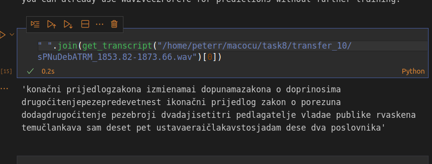
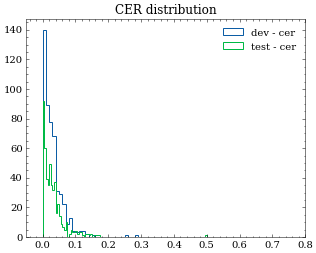
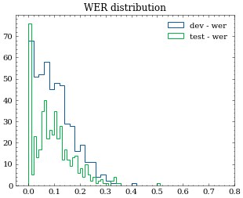

# task8
Constructing HF transformer dataset with inline mp3-to-wav converter


# Remarks @ 2022-03-11T12:24:14

I acquired a brief .mp3 file and tried converting it with ffmpeg: `ffmpeg -i sample.mp3 -ar 16000 sample.wav`. It turns out the difference in filesizes is not as dramatic as internet had me believe: instead of 10x difference we only see 2.6x reduction in filesize.

When implementing the same functionality in python with `pydub`, the file size is precisely the same as before.

Next step will be dataset preparation with inline conversion.


# Addendum 2022-03-11T14:20:44

The solution has been proposed in [the notebook](1.ipynb), but so far has not been tested:

```python
import tempfile
from pydub import AudioSegment
def load_audio(path):
    with tempfile.NamedTemporaryFile() as f:
        AudioSegment.from_mp3(path).export(
                f.name,
                format="wav", 
                parameters=["-ar", "16000"]
                )
        return datasets.Audio(sampling_rate=16000).decode_example(f.name)
```

## Conversion speed

Based on my one-shot estimation for a 8.7s long sample I estimate we need about 19 hours for the conversion alone. 

# Moving on

As per Nikola's email I start working on the generation of a random sample of wavs. 

Meeting notes:
* Use reconames as well (also for audio files).
* Open a google sheet (so export as excel and rsync to laptop.)

Ok, due to weird glitches in the file I/O about 30% of the files won't open. For now I just pass over them. I can process more later and get the sample count to 1k.


# Addendum 2022-03-14T14:17:38

It was noticed that the `FileNotFoundError` was being raised due to the inconsistent whitespace use in the mapping. I managed to remove most of them, for all of them the implementation will follow later.

# Meeting notes 2022-03-14T15:36:25
* Min sim: 0.8
* `from Levenshtein import distance`
* ```def sim(a, b):
    return 1-(distance(a,b)*2/(len(a)+len(b)))```
* Prepare the ALL the data for training: prefered nomenclature: `[youtube hash]_123.4-135.4`
* Keep in mind what instances were sent for sampling.
* How many have sim < 0.8? This could be test set.
* ~~One yt file could be dev, the rest train.~~ Take random subset for dev split. 2k samples.

During the preparation I take the following notes:
* YT hashes are all 11 characters long. The character set has minuses, underscores, ... but not slashes, hashes, dots.
* With my improved error correction I can find all the true filenames. The function has been improved so that I can do the entire corpus in 0.8s instead of 3min45s (24.5dB speedup!)
* 94% of the transcripts satisfy the `sim > 0.8` condition.
* Splitting was performed with a random seed, this way it is more controllable.


At 2022-03-14T17:28:10 the processing was started. It seems to be going really fast. Probably this is due to the optimizations; only one file segment is opened at one time and we have no conversion to mp3. I don't yet know which factor is more important, but would love to know. I estimate the processing will be done in 2.23 hours, which is just as fast as the sample dataset generation.


# Addendum 2022-03-14T18:59:38

So far everything is going as planned. I estimate 39 minutes are left.

# Addendum 2022-03-15T07:32:18

The final size of the corpus is 1.3TB. I opted for generation of a subset in order to be able to fit it all on kt-vm-1tb. I copied the files to a separate folder, which took quite long, and then I started rsyncing data to kt-vm-1TB.

Meeting notes:
* ✓Drop instances where sim < 0.8. Move more data.
* ✓Prepare a new vocabulary.
* ✓Drop what was used in the sample.
* Dev: use 500 samples.
* Train: as much as feasible.
* Test: will be given later.

# Addendum 2022-03-15T12:27:38
Ok, we filled the disk to 97%, I could go higher, but not significantly due to the requirements of saved models and other users.

I started my first training set (directory `6_`). I notice the data loading take quite a long time, probably due to the fact that the dataset is bigger. So far I've not even read the data after 65 min....

# Addendum 2022-03-15T14:44:30

Loading the dataset takes a long time. I experimented with only 1% of the dataset and found out it takes 6 min to process it in a notebook, meaning that I'd need 10 hours to do it. The bottle neck is the part

```python

import datasets
from datasets import load_dataset, load_metric, Audio
def load_audio(path):
    return datasets.Audio(sampling_rate=16000).decode_example(path)

# Adding audio
common_voice_train_df.loc[:, "audio"] = common_voice_train_df.path.apply(load_audio)
```

Running it in a script instead of in a notebook doesn't change the performance significantly.

After a skype chat with Nikola it had been found that the data was sampled with 48kHz frequency instead of 16. That was corrected and new files are being transfered as we speak.

After the files have been transfered,  I started a small trial run to see if it runs OK. It does, it seems that with only a 1k subset the loading and training runs without problems. It takes 20 minutes to run, meaning that we can expect 3 days of training for the full dataset...

To test if everything works as it should I ran another round, this time with 3k instances.

✓ Since the training won't run, go for 200hours of data.

Unnormalized transcripts: /home/korzinek/kaldi/exp/ali_all/unnorm.json
Nikola suggests to do lowercasing and removal of puctiation. Compare with normalized performance. Once the training works of course.

✓ Transform the corpus to mono!

# Addendum 2022-03-18T11:20:56

The training still doesn't run. It seems the limiting factor is not the training, but the dataset loading. I've limited the data to 33k instances. This made it to training, but then failed:

```python
---------------------------------------------------------------------------
OSError                                   Traceback (most recent call last)
~/anaconda3/lib/python3.8/site-packages/wandb/sdk/wandb_init.py in init(job_type, dir, config, project, entity, reinit, tags, group, name, notes, magic, config_exclude_keys, config_include_keys, anonymous, mode, allow_val_change, resume, force, tensorboard, sync_tensorboard, monitor_gym, save_code, id, settings)
    869         try:
--> 870             run = wi.init()
    871             except_exit = wi.settings._except_exit

~/anaconda3/lib/python3.8/site-packages/wandb/sdk/wandb_init.py in init(self)
    441         backend = Backend(settings=s, manager=manager)
--> 442         backend.ensure_launched()
    443         backend.server_connect()

~/anaconda3/lib/python3.8/site-packages/wandb/sdk/backend/backend.py in ensure_launched(self)
    167 
--> 168         self.record_q = self._multiprocessing.Queue()
    169         self.result_q = self._multiprocessing.Queue()

~/anaconda3/lib/python3.8/multiprocessing/context.py in Queue(self, maxsize)
    102         from .queues import Queue
--> 103         return Queue(maxsize, ctx=self.get_context())
    104 

~/anaconda3/lib/python3.8/multiprocessing/queues.py in __init__(self, maxsize, ctx)
     41         self._reader, self._writer = connection.Pipe(duplex=False)
---> 42         self._rlock = ctx.Lock()
     43         self._opid = os.getpid()

~/anaconda3/lib/python3.8/multiprocessing/context.py in Lock(self)
     67         from .synchronize import Lock
---> 68         return Lock(ctx=self.get_context())
     69 

~/anaconda3/lib/python3.8/multiprocessing/synchronize.py in __init__(self, ctx)
    161     def __init__(self, *, ctx):
--> 162         SemLock.__init__(self, SEMAPHORE, 1, 1, ctx=ctx)
    163 

~/anaconda3/lib/python3.8/multiprocessing/synchronize.py in __init__(self, kind, value, maxvalue, ctx)
     79             from .resource_tracker import register
---> 80             register(self._semlock.name, "semaphore")
     81             util.Finalize(self, SemLock._cleanup, (self._semlock.name,),

~/anaconda3/lib/python3.8/multiprocessing/resource_tracker.py in register(self, name, rtype)
    146         '''Register name of resource with resource tracker.'''
--> 147         self._send('REGISTER', name, rtype)
    148 

~/anaconda3/lib/python3.8/multiprocessing/resource_tracker.py in _send(self, cmd, name, rtype)
    153     def _send(self, cmd, name, rtype):
--> 154         self.ensure_running()
    155         msg = '{0}:{1}:{2}\n'.format(cmd, name, rtype).encode('ascii')

~/anaconda3/lib/python3.8/multiprocessing/resource_tracker.py in ensure_running(self)
    120                         signal.pthread_sigmask(signal.SIG_BLOCK, _IGNORED_SIGNALS)
--> 121                     pid = util.spawnv_passfds(exe, args, fds_to_pass)
    122                 finally:

~/anaconda3/lib/python3.8/multiprocessing/util.py in spawnv_passfds(path, args, passfds)
    451     try:
--> 452         return _posixsubprocess.fork_exec(
    453             args, [os.fsencode(path)], True, passfds, None, None,

OSError: [Errno 12] Cannot allocate memory

The above exception was the direct cause of the following exception:

Exception                                 Traceback (most recent call last)
<ipython-input-6-055d89daa74d> in <module>
     65 )
     66 
---> 67 trainer.train()
     68 
     69 

~/anaconda3/lib/python3.8/site-packages/transformers/trainer.py in train(self, resume_from_checkpoint, trial, ignore_keys_for_eval, **kwargs)
   1258         model.zero_grad()
   1259 
-> 1260         self.control = self.callback_handler.on_train_begin(args, self.state, self.control)
   1261 
   1262         # Skip the first epochs_trained epochs to get the random state of the dataloader at the right point.

~/anaconda3/lib/python3.8/site-packages/transformers/trainer_callback.py in on_train_begin(self, args, state, control)
    344     def on_train_begin(self, args: TrainingArguments, state: TrainerState, control: TrainerControl):
    345         control.should_training_stop = False
--> 346         return self.call_event("on_train_begin", args, state, control)
    347 
    348     def on_train_end(self, args: TrainingArguments, state: TrainerState, control: TrainerControl):

~/anaconda3/lib/python3.8/site-packages/transformers/trainer_callback.py in call_event(self, event, args, state, control, **kwargs)
    385     def call_event(self, event, args, state, control, **kwargs):
    386         for callback in self.callbacks:
--> 387             result = getattr(callback, event)(
    388                 args,
    389                 state,

~/anaconda3/lib/python3.8/site-packages/transformers/integrations.py in on_train_begin(self, args, state, control, model, **kwargs)
    538             self._initialized = False
    539         if not self._initialized:
--> 540             self.setup(args, state, model, **kwargs)
    541 
    542     def on_train_end(self, args, state, control, model=None, tokenizer=None, **kwargs):

~/anaconda3/lib/python3.8/site-packages/transformers/integrations.py in setup(self, args, state, model, **kwargs)
    511 
    512             if self._wandb.run is None:
--> 513                 self._wandb.init(
    514                     project=os.getenv("WANDB_PROJECT", "huggingface"),
    515                     name=run_name,

~/anaconda3/lib/python3.8/site-packages/wandb/sdk/wandb_init.py in init(job_type, dir, config, project, entity, reinit, tags, group, name, notes, magic, config_exclude_keys, config_include_keys, anonymous, mode, allow_val_change, resume, force, tensorboard, sync_tensorboard, monitor_gym, save_code, id, settings)
    906             if except_exit:
    907                 os._exit(-1)
--> 908             six.raise_from(Exception("problem"), error_seen)
    909     return run

~/anaconda3/lib/python3.8/site-packages/six.py in raise_from(value, from_value)

Exception: problem
```
The OSError[12] seems to be related to CPU. I noticed that only one core gets maxxed out, hinting that there is no parallelization in effect.

The kernel didn't die this time, so I was able to try the training again, with the only correction being inclusion of previously inhibited duration clipper at 20s. My next experiments will be in reducing the per device batch size from 16 to 8. This also failed, so I'm down to 4. 

# Addendum 2022-03-19T12:01:23

So far all training sessions crashed miserably. I therefore tried once again with 25k samples, because we know that we can do it with 20k. I will prepare a new transfer directory with newly augmented transcriptions, and if the training on 25k samples works, we'll use that for training.

# Addendum 2022-03-19T10:16:03 - Further file structure changes

In `selection_16000_mono` I will only include files that appear in Nikola's transcripts [here](/home/nikola/projects/parlaspeech/ParlaSpeech-HR.v1.0.jsonl).

I will delete the surplus files and correct the transcripts (`selection.json`, `selection.csv`). This was completed at 2022-03-19T10:38:41.


# Addendum 2022-03-19T13:06:24

25000 instances would finally run. I had new data ready, so I switched to that. Will report in cca 9 hours.

Results from the first successful training are far worse from what we've seen before...

Step	Training Loss	Validation Loss	Wer
400	    3.193200	    0.618208	    1.000000
800	    0.404400	    0.253443	    0.984000
1200	0.269600	    0.207803	    0.972000
1600	0.237100	    0.163443	    0.956000
2000	0.194700	    0.153030	    0.938000
2400	0.175000	    0.148244	    0.950000
2800	0.172600	    0.144318	    0.942000
3200	0.157700	    0.141186	    0.930000
3600	0.132300	    0.139779	    0.924000
4000	0.128800	    0.135688	    0.922000
4400	0.119400	    0.129832	    0.922000
4800	0.103100	    0.132970	    0.910000
5200	0.086900	    0.129028	    0.902000
5600	0.085200	    0.128787	    0.900000
6000	0.082400	    0.125917	    0.898000

I proceeded with doubling the learning rate (from 3e-4 to 6e-4), reducing the number of evaluations during the training and re-increasing the per-device batch size to 16 again.

This run performed similarly poopily.

# Meeting notes 2022-03-21T07:58:49

* Are the wavs ok? Play it back, check with soxi. Are they corrupted? Do they all have sample rate 16kHz, channels 1? 
* Performance with old vocab.json? Is it better (WER at start cca 0.5?)
* Debug with small dataset; every change from December sessions
* Check how the dataset looks like when passed into HF at different stages. Do the transcripts look ok or do they become corrupted at some point?
* Check the model output (models 200, 300). What comes out? How they differ?


# Addendum 2022-03-21T08:39:32

I checked all the files in `transfer_10` directory for sample rate and number of channels. All are 16kHz and mono.

Full soxi output looks like this:
```
Input File     : 'transfer_10/sPNuDebATRM_1853.82-1873.66.wav'
Channels       : 1
Sample Rate    : 16000
Precision      : 16-bit
Duration       : 00:00:19.84 = 317440 samples ~ 1488 CDDA sectors
File Size      : 635k
Bit Rate       : 256k
Sample Encoding: 16-bit Signed Integer PCM
```

While the files from december sessions look like this:
```
Input File     : '00000001.flac.wav'
Channels       : 1
Sample Rate    : 16000
Precision      : 16-bit
Duration       : 00:00:07.80 = 124800 samples ~ 585 CDDA sectors
File Size      : 250k
Bit Rate       : 256k
Sample Encoding: 16-bit Signed Integer PCM
```

I also checked bitrate. It seems inconsistent: `Detected bitrate in transfer_10 directory:  {'257k', '258k', '256k', '259k'}`

This is weird, as [this webpage](https://sound.stackexchange.com/questions/37424/how-do-you-compute-the-bitrate-of-a-wav-file#37433) statest the following equation:

```Bits Per Second (bps) = Sample Rate (Hz) * Word Length (bits) * Channel Count```

Since the sample rate and channel count are constant in our case, it seems that word length is not. 

To see what we have in the `transfer_10` directory precision wise, I performed a new scan, but the only precision found was 16 bit...

The analysis is available in [this notebook](12_dataset_inspection.ipynb).

Re: inspecting model outputs: ~~I can't run the inspection until my current mini-experiment with old vocabulary finishes due to `CudaOutOfMemory` issues. ~~ I solved that, but I shalln't be able to fiddle around with the old and new vocabularies until the training finishes, just in case.

The outputs are gharbled:
* setup: old vocab, 300_ model. Output: `['?qs?p?h?m?b?ž?b?w?b?a?e?s?v?h?b?aja?p?t?j?c?b?a?q?s?p?a?ä?sb?d?j?u?b?a?ä?b?a?q?s?f?e?t?kf?e?oj?l?b?a?sf?q?v?c?mj?l?f?a?c?f?ä?a?p?h?s?b?oj?đ?f?ok?b?a?u?s?b?k?b?okb?a?n?b?o?e?b?u?b?']`
* setup: old_vocab, 200_ model. Output: `['?q?s?p?h?m?b?ž?b?w?b?a?e?s?v?h?b?a?k?p?d?j?q?b?a?c?s?p?ä?b?a?g?j?u?b?a?ä?b?a?q?s?f?e?t?kf?e?o?j?l?b?a?sf?q?v?c?m?j?l?f?a?c?f?ä?a?p?h?s?b?o?j?đ?f?okb?a?u?s?b?k?b?okb?a?n?b?ao?e?b?u?']`

There is no difference if I set word_delimiter to either `"|"` or `" "`. But if I input the new tokenizer:

* setup: new vocab, 300_ model, delim: `"|"`: error.
* setup: new vocab, 300_ model, delim: `" "`: output: `['proglašava[unk]druga[unk]i[unk]osiba[unk]pro[unk]zracita[unk]za[unk]predsjednika[unk]republike[unk]bez[unk]ograničenja[unk]trajanja[unk]mandata']`
* setup: new vocab, 300_ model, delim: `"|"`: error
* setup: new vocab, 200_ model, delim: `" "`: output: `['proglašava[unk]druga[unk]jocipa[unk]broza[unk]fita[unk]za[unk]predsjednika[unk]republike[unk]bez[unk]ograničenja[unk]trajanja[unk]ma[unk]ndat']`

In the mean time the toy example training session ended. 


# Meeting notes 2022-03-21T10:59:17

* Use new vocabulary, use space as delimiter.
* Check the code. Where does it get used?
* Inspect what is going on when loading data. Where does this word delimiting happen?

# Addendum 2022-03-21T11:16:00

So I was able to replicate the weird behaviour on train side by doing the following:
* Import the december tokenizer. Set word_delim="|". Encoded-decoded sentence: `'neće rasti niti kunu stoga je bilo pametno u ovom'`
* Import the december tokenizer. Set word_delim=" ". Encoded-decoded sentence: `'neće[unk]rasti[unk]niti[unk]kunu[unk]stoga[unk]je[unk]bilo[unk]pametno[unk]u[unk]ovom'`
* Import the new tokenizer. Set word_delim=" ". Encoded-decoded sentence: `'neće rasti niti kunu stoga je bilo pametno u ovom'`
* Import the new tokenizer. Set word_delim="|". Encoded-decoded sentence: `'sneće[unk]rasti[unk]niti[unk]kunu[unk]stoga[unk]je[unk]bilo[unk]pametno[unk]u[unk]ovom'`

Default behaviour: 
```python
class transformers.Wav2Vec2Tokenizer(vocab_file, bos_token='<s>', eos_token='</s>', unk_token='<unk>', pad_token='<pad>', word_delimiter_token='|', do_lower_case=False, **kwargs)
```
This happens as soon as we call the `prepare_dataset` function on the dataset. The recipe to go forward is therefore using the new dataset and `" "` as word delimiter.


# Addendum 2022-03-21T14:03:02
Ok, I ran another mini training session. Two consecutive evaluations returned WER of 1.0, same as the others failed attempts. I shall wait for another eval run, then kill the training and look at the transcripts directly. Unfortunately I cannot train and evaluate simultaneously due to GPU constraints.


# Addendum 2022-03-21T15:32:05
The results look ok. We don't experience problems with weird tokens anymore and the output is sensible, albeit very undertrained.



# Meeting notes 2022-03-21T15:47:22
* ✓ Prepare a new train, dev, test dataset.
* ✓ Remove those instances that were in "samples." Check that sim >= 0.8 for all. Save the dataset and use when training. Nikola's 5¢: prepare normalised dataset first, train, and then parse the rest of the dataset.
* One model on normalized -> `words`, one on original transcription `unnormalized` (with a twist: lowercase, all punctuation is to be removed except potentially dots after numbers) 
* ✓ Dev: 500 instances, test: 500. 
* Train for 8 epochs on 25k samples. Save more checkpoints than 1 (ideally: one at 4 epochs, one at 8)

Currently (2022-03-21T18:03:22) the training of the first model is in progress.
# Addendum 2022-03-22T10:03:03

With the first model trained I can evaluate it on `dev` and `test` splits:

```
With normalized model: dev_wer=0.1036 , dev_cer=0.0314 ,
 (18_normalised)       test_wer=0.1015, test_cer=0.0304,
```

CER metric distribution across test and dev looks like this:




while WER metric distribution looks like this:




I noticed some weird outliers:
|     | hashname                          | human_transcript                                                                                                                                                                                                                      | unnormalized_transcript                                                                                                                                                                                         | 18_normalised_output                                                                                                                                                                                                         |      wer |       cer | split | Peter's verdict                                                                                                                      |
|----:|:----------------------------------|:--------------------------------------------------------------------------------------------------------------------------------------------------------------------------------------------------------------------------------------|:----------------------------------------------------------------------------------------------------------------------------------------------------------------------------------------------------------------|:-----------------------------------------------------------------------------------------------------------------------------------------------------------------------------------------------------------------------------|---------:|----------:|:------|:-------------------------------------------------------------------------------------------------------------------------------------|
|  47 | LfkFqOr01h4_1529.55-1530.32.wav   | neznanim                                                                                                                                                                                                                              | neznanim                                                                                                                                                                                                        | ne znanim                                                                                                                                                                                                                    |        2 |     0.125 | dev   | should be `neznanim`                                                                                                                 |
| 125 | 3yuEqtP43QI_5391.01-5392.76.wav   | devedeset tritrinaesteez                                                                                                                                                                                                              | 9313eez                                                                                                                                                                                                         | devedeset tri tu trinaest z                                                                                                                                                                                                  |        2 |      0.25 | dev   | shouldb be `devedeset tritrinaesteez`. Quite a weird word.                                                                           |
| 310 | VbHdjxinAXk_2490.72-2510.16.wav   | i prezentirati mu ono što bi on možda mogao i realizirati iznimno je važno evo poštovani kolega                                                                                                                                       | i prezentirati mu ono što bi on možda mogao i realizirati iznimno je važno evo poštovani kolega                                                                                                                 | i prezentirati m ono što bi on možda mogao i realizirati iznimno je važno evo puno vam hvala hvala imamo dvije replike prva je uvaženog zastupnika branka hrga hvala lijepa poštovani kolega                                 | 0.941176 |         1 | dev   | human transcript incomplete! our output is reasonable.                                                                               |
| 336 | l_K8z4JMT9k_6360.98-6378.72.wav   | ispod žita nije prodaja na londonskoj burzi hadeze nije prodao ni jednu dionicu molu ni jednu jedinu za razliku od esdepe koji je prodao dvadeset pet posto dionice inae molu hvala lijepa na držanju preciznosti što se vremena tiče | ispod žita nije prodaja na londonskoj burzi hdz nije prodao ni jednu dionicu molu ni jednu jedinu za razliku od sdp koji je prodao 25 dionice inae molu hvala lijepa na držanju preciznosti što se vremena tiče | ispod žita nije prodajana londonskoj burzi hadeze nije prodao nijednu dionicu molu nijednu jedinu za razliku od esdepea koji prodao dvadeset pet posto dionica inemolu hvala lijepa na drženju preciznosti šlosevremena tiće | 0.410256 | 0.0655022 | dev   | first part as great as me. After `hvala lijepa`: another speaker, but sound clear, speed reasonable. Model is not performing nicely. |
| 202 | XDOVoojci5A_23516.14-23516.76.wav | odlaze                                                                                                                                                                                                                                | odlaze                                                                                                                                                                                                          | odnose                                                                                                                                                                                                                       |        1 |       0.5 | nan   | Is probably really `odlaze`.                                                                                                         |
| 275 | g_7n37_9B_E_7943.1-7944.4.wav     | neizvjesnost dovodi                                                                                                                                                                                                                   | neizvjesnost dovodi                                                                                                                                                                                             | neizvjesnost dovodi do                                                                                                                                                                                                       |      0.5 |  0.157895 | nan   | human transcript incomplete, our output is reasonable                                                                                |


Possible improvements to the trainer:
* eval_strategy: "epoch"
* save_strategy: "epoch"


# Addendum 2022-03-22T12:44:04
Weird characters that were not picked up by the punctuation filter:

```
 '–',
 '’',
 '“',
 '„'
 ```

 

# Meeting notes 2022-03-28T12:58:41 - Bojan Evkoski

* Lower the LR 10x, monitor eval loss -> this did not work, the results are way worse.

# Addendum 2022-03-29T08:49:30

Lower LR + 200h data produced significantly worse results. To investigate only the effect of the new data, I'm running a new training with the original LR.

Results: superb:

Epoch	Training Loss	Validation Loss	Wer	Cer
1	3.044100	0.188277	0.173580	0.049340
2	0.184200	0.123732	0.099893	0.031663
3	0.128000	0.111795	0.085531	0.027965
4	0.101500	0.107521	0.077653	0.026187


# Meeting notes - Nikola 2022-03-30T13:30:30

* Run eval on VoxPopuli dev and test (separately) (with the filtering - where raw_transcript is not NaN.) Preprocess as before: lowercase, remove puctuation.
* Use Tuesday's model (25)
* Try to not trim the audio.
* Investigate the possibility of preloading datasets and cpickling them.

# Addendum 2022-03-31T23:38:29

Data loading crashed at 66987/380837. Not bad. Even suspiciously good. The log said it clocked 200 executions per second, which is orders of magnitude better than before.

Retrying.

I inserted some more garbage collection statements for good measure.

I monitor resources with htop and diskspace with df. It seems we jam up one core, but the disk space so far seems not to be filling up.

The second iteration clocks 3.5 executions per second, which is more reasonable. But this means we can expect about 30h just for dataset preparation...

# Addendum 2022-04-01T01:19:39

So far seems to work ok.

# Addendum 2022-04-01T07:08:43

After 320 minutes it crashed anew. My next fix is to check whether or not it runs ok if I optimize batch size in the `datasets.Dataset.map` method.